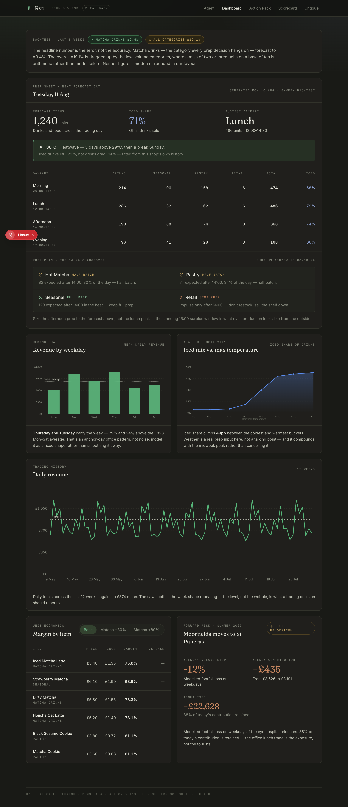
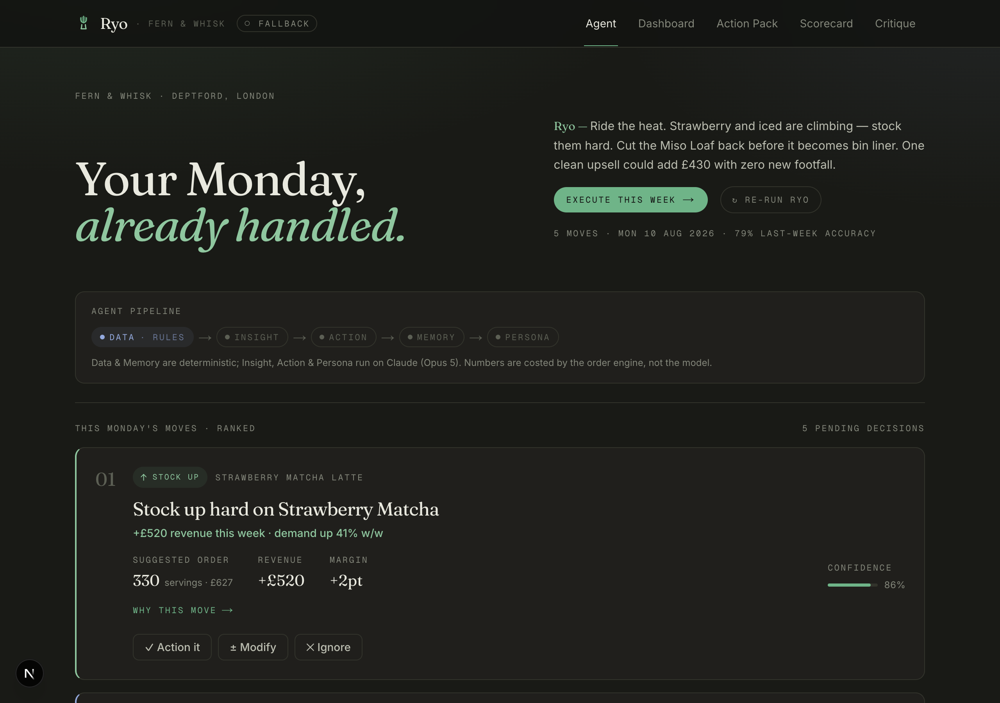

<div align="center">

# 🍵 Ryo

### An agentic **AI Café Operator** for specialty matcha cafés.

*Your Monday, already handled.*

[](https://nextjs.org/)
[](https://react.dev/)
[](https://tailwindcss.com/)
[](#-the-agent-pipeline)
[](#-the-dashboard)
[](#-the-closed-loop)

</div>

---

Most café dashboards answer *"what did I sell?"* **Ryo answers the question an owner
actually has on Monday morning:** *"what do I order, who do I tell what, and what
should I promote this week — and did last week's calls actually work?"*

It reads the week's tills, the weather, and the menu's own economics, then forms
**opinions** — a short ranked list of concrete Moves — turns them into a one-click
Action Pack (supplier order, staff cards, social), and **scores itself next Monday**
against what the tills actually did. No busywork, no neutral dashboards, no theatre.

> 🍵 Speaks like a calm, slightly dry Japanese sous-chef who *hates* waste.
> **Ryo** (涼 *cool / refreshing* · 量 *measure*) — the two things a café runs on.

<div align="center">



<sub>The **Dashboard** — honest backtest, next-day prep sheet, daypart forecast, and the charts.</sub>



<sub>The **Agent** — Monday briefing, the agent pipeline trace, and ranked moves.</sub>

</div>

### 💚 Why it's different

- 🎯 **Action, not insight** — every screen ends in something you can *do* today.
- 🔁 **Closed-loop or it's theatre** — recommendations are scored against reality, and the model adjusts on its own misses, in the open.
- 🧾 **One-click Action Pack** — Monday's moves become a supplier order (CSV), staff cards, and the week's social in one tap.
- 🧮 **Honest about error** — the backtest shows the *error* (±9.4%), not a flattering accuracy. Nothing rounded in our favour.
- 🗣️ **Opinionated** — Ryo ranks and commits. No "here are 40 charts, you decide."

---

## ⏱️ The 60-second story

```
        Monday, 08:00  ☕  the owner opens Ryo
                    │
                    ▼
   Ryo reads: 13 weeks of tills · ☀️ weather · 🧮 menu economics
                    │
                    ▼
        Forms opinions → 5 ranked MOVES
   ↑ Stock Up   ◎ Promote   ↓ Cut   ◇ Experiment
   (each: impact line · reasoning · evidence · confidence)
                    │
              owner taps  ✓ Action / ± Modify / ✕ Ignore     ← HUMAN GATE
                    │
                    ▼
        "Execute this week"  →  🧾 ACTION PACK
   supplier order (CSV) · staff cards · social · impact sim
                    │
                    ▼
        ……… the week happens …………………………
                    │
                    ▼
     Next Monday: 🔁 SCORECARD — predicted vs actual
        accuracy scored · the model adjusts
```

---

## 🖥️ Five screens

| | Screen | What it does |
|---|---|---|
| 🍓 | **Agent** | The Monday briefing — Ryo's opinion + 5 ranked Moves, each with a one-line impact (revenue / waste / margin), expandable reasoning + evidence, and a confidence score. Tap **Action / Modify / Ignore**. |
| 📈 | **Dashboard** | Honest backtest band · next-day prep sheet + daypart forecast · prep-plan changeover cards · weekday-revenue bars · 🥶 weather-sensitivity S-curve · 12-week trading history · unit-economics scenarios · forward-risk model. |
| 🧾 | **Action Pack** | One click → supplier order (copy + CSV) · printable staff cards · Instagram + Stories copy · expected-impact simulation. |
| 🔁 | **Scorecard** | The closed loop — what Ryo predicted vs. what the tills did, per-move accuracy, and how the model adjusted. |
| 📸 | **Critique** | Photograph the pastry case → Ryo reads the layout against demand and says what's in the wrong place, with the velocity to prove it. |

---

## 🎨 The look

Editorial dark. Warm charcoal, a high-contrast **Fraunces** serif display with an
*italic matcha accent*, monospace uppercase micro-labels, and **sage-green +
periwinkle** data accents. Calm, precise, high information density — a dashboard
that looks like it costs money.

---

## 🧠 The agent pipeline

The **Agent** tab runs a real multi-agent pipeline server-side:

```
Data (rules) → Insight (Claude) → Action (Claude) → Memory (rules) → Persona
```

- **Data** assembles the tills, weather, and unit economics into a context bundle.
- **Insight** (Claude Opus 5) reads it and surfaces the sharpest demand / attach / waste / margin signals.
- **Action** (Claude Opus 5) turns those into ranked Moves + the staff cards and social copy — via tool-forced **structured output**, so the shape is guaranteed.
- **Memory** feeds last week's predictions-vs-actuals back in, and writes this week's moves to a store.
- Order quantities are **costed by the deterministic engine**, not the model — the numbers are real.

Every run shows its own trace and a **Live agents / Fallback** badge. If there's no
`ANTHROPIC_API_KEY` (or the venue wifi dies), it serves an identical-shape
**deterministic fallback** — the demo never breaks.

## 🚀 Run it

```bash
npm install
npm run dev        # → http://localhost:3000
```

For the **live** agent pipeline, add a key (server-side only, git-ignored):

```bash
echo "ANTHROPIC_API_KEY=sk-ant-..." > .env.local
```

Without one, Ryo runs the deterministic fallback — the full demo still works, on
mock data, with no wifi dependency. 🛜💀→🚫

---

## ✅ What's real vs. 🔧 what's a documented shortcut

- ✅ **Real:** the [agent pipeline](#-the-agent-pipeline) (Insight + Action on Claude Opus 5, structured output, memory feedback), the order-quantity math (`velocity × safety − stock + lead buffer`), unit-economics scenarios, closed-loop feedback with persistence, and every chart (hand-built SVG, zero chart libraries).
- 🔧 **Mocked, on purpose:** the Square + weather feeds and the Critique's vision pass are convincingly simulated rather than live — and the pipeline ships with a deterministic fallback so a demo runs with or without a key. Wiring real **Claude vision** and a **Square** feed is the first `TODO`; the UI and data contracts are already shaped for it.

> ⚠️ The café **Fern & Whisk** and all figures are **fictional on purpose** — a demo
> build, no claims about a real business.

---

## 🏗️ Structure

```
src/
  lib/ryo.ts          # domain types · café data · order engine · mock/fallback
  lib/agents/         # Data→Insight→Action→Memory→Persona (server-side, Claude Opus 5)
  app/api/brief/      # runs the pipeline; falls back to deterministic data
  components/
    AppShell.tsx      # nav + closed-loop state (persisted)
    Briefing.tsx      # the Monday briefing (Agent)
    MoveCard.tsx      # a ranked move + reasoning + feedback
    Dashboard.tsx     # backtest · prep sheet · charts · economics · risk
    charts.tsx        # BarChart · AreaLine · SawtoothLine (inline SVG)
    ActionPack.tsx    # order · staff cards · social · impact sim
    Scorecard.tsx     # predicted vs actual, closed loop
    Critique.tsx      # photo → merchandising verdict
  app/                # Next.js App Router · globals (the design system)
```

---

*Built fast, built to demo. 🍵*
